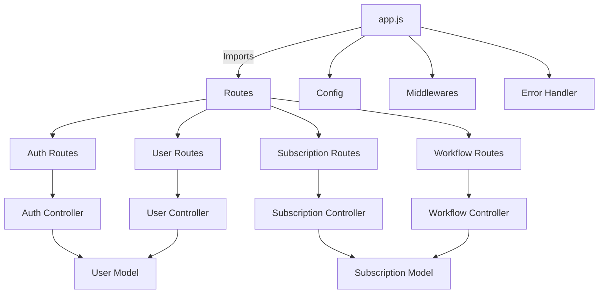

# Subscription Backend


## 🚀 Overview

The **Subscription Backend** is a robust and scalable API service designed for managing user subscriptions efficiently. It enables seamless authentication, subscription management ensuring security and performance.

---

## 🎯 Features

✅ **User Authentication**: Secure registration & login using JWT authentication.\
✅ **Subscription Management**: Users can subscribe or cancel plans.\
✅ **Advance Rate Limiting & Bot Protection**: Integrates with **Arcjet** to secure entire backend from bot and abuse usage.\
✅ **Logging**: Monitor user activities and analyze insights for better debugging.\
✅ **Email Reminders**: Automating smart email reminders before autorenewals with **workflows & Upstash**\
✅ **Global Error Handling**: Input Validations.

---

## 🛠️ Tech Stack

- **Backend**: Node.js with Express.js
- **Database**: MongoDB (NoSQL)
- **Authentication**: JWT (JSON Web Token)
- **Deployment**: Render (Cloud hosting)

---

## 📌 Architecture and System Flow


---

## 🏠 Installation & Setup

### 🔹 Prerequisites

Ensure you have the following installed:

- **Node.js** (v16 or later)
- **MongoDB** (Local or Atlas Cloud Database)
- **Postman** (Optional for API testing)

### 🔹 Steps to Run Locally

1️⃣ **Clone the repository**

```sh
  git clone https://github.com/DhruvBajoria/subscription_backend.git
  cd subscription_backend
```

2️⃣ **Install dependencies**

```sh
  npm install
```

3️⃣ **Set up environment variables** Create a `.env` file in the root directory and configure:

```sh
PORT=5000
SERVER_URL = "http://localhost:5000

#DB
DB_URI=your_mongodb_connection_string

#JWT AUTH
JWT_SECRET=your_secret_key
JWT_EXPIRES_IN="1d"

#ARCJET
ARCJET_KEY= your_arcjet_key
ARCJET_ENV="development"

#UPSTASH
QSTASH_URL = your_url
QSTASH_TOKEN = your_token

#NODEMAILER
EMAIL_PASSWORD=your_app_password
```

4️⃣ **Start the server**

```sh
  npm run dev
```

The backend will be running on `http://localhost:5000`

---


### 🔹 Key API Endpoints

#### 🧑‍💻 User Authentication

- **Register User**: `POST /api/v1/auth/sign-up`
- **Login User**: `POST /api/v1/auth/sign-in`
- **Logout User**: `POST /api/v1/auth/sign-out`

#### 🎟️ Subscription Management

- **Get Upcoming Renewals**:`GET /api/v1/subscriptions/upcoming-renewals`
- **Get all Subscription Plans**: `GET /api/v1/subscriptions`
- **Get a particular Subscription**: `GET /api/v1/subscriptions/:id`
- **Subscribe to a Plan**: `POST /api/v1/subscriptions`
- **Update a Subscription**: `PUT /api/v1/subscriptions/:id`
- **Delete Subscription**: `Delete /api/v1/subscriptions/:id`
- **Cancel Subscription**: `PUT /api/v1/subscriptions/:id/cancel`
- **Get User Subscriptions**: GET /api/v1/subscriptions/user/:id`

#### 👤 User Management

- **Get All Users**: `GET /api/v1/users/`
- **Get User by ID**: `GET /api/v1/users/:id`
- **Create User**: `POST /api/v1/users/`
- **Update User**: `PUT /api/v1/users/:id`
- **Delete User:** `DELETE /api/v1/users/:id`
---

## 🌐 Deployment

The backend is deployed on **Render**.

### 🔹 Live API Base URL:

```
https://subscription-backend-h9pg.onrender.com
```

---

## 🤝 Contributing

Want to improve this project? Follow these steps: 1️⃣ **Fork the repository**. 2️⃣ **Create a new branch** (`git checkout -b feature-branch`). 3️⃣ **Commit changes** (`git commit -m 'Added new feature'`). 4️⃣ **Push to the branch** (`git push origin feature-branch`). 5️⃣ **Open a Pull Request**.

---

## 📩 Contact

For queries, connect with me:

- **GitHub**: [DhruvBajoria](https://github.com/DhruvBajoria)
- **LinkedIn**: [Dhruv Bajoria](https://www.linkedin.com/in/dhruv-bajoria-ab25b21ab/)

💡 **Like this project? Give it a star ⭐️!**

